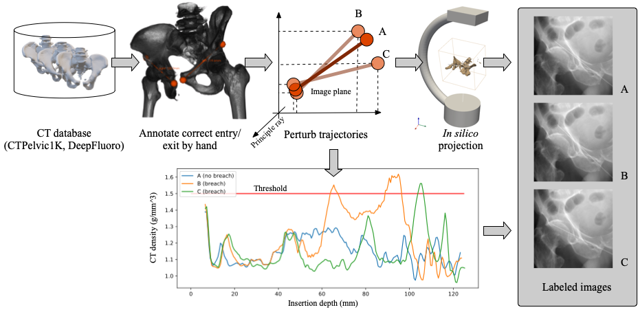

<div align="center">



# Cortical Breach Detection

<!-- _[Read the paper](todo)._ -->

</div>

<div align="left">
 
## Description

During internal fixation of fractures, it is often challenging to safely position a K-wire due to the projective nature of X-ray images, especially in complex anatomy like the superior pubic ramus. This can result in excess acquisitions and repeat attempts. A perception-based algorithm that interprets interventional radiographs to infer the likelihood of cortical breach might reduce both. Here, we present first steps toward developing such an algorithm. We use an in silico strategy for collection of X-rays with and without cortical breach and demonstrate its suitability for machine learning by training an algorithm to detect cortical breach for fully-inserted K-wires.

If you find our work useful, please consider citing our paper:

```bibtex
@article{killeen2022cortical,
  title={Toward Perception-based Anticipation of Cortical BreachDuring K-wire Fixation of the Pelvis},
  author={Killeen, Benjamin D. and Chakraborty, Shreya and Osgood, Greg and Unberath, Mathias},
  journal={SPIE Medical Imaging},
  year={2022}
}
```

## Installation

These instructions assume you are using a linux machine with at least one GPU, CUDA >= 11.1.

1. Create a new repository using this template and change to the root directory. For example,

   ```bash
   git clone git@github.com:benjamindkilleen/cortical-breach-detection.git
   cd cortical-breach-detection
   ```

2. Install dependencies using [Anaconda](https://www.anaconda.com/):

   ```bash
   conda env create -f environment.yml
   conda activate cortical-breach-detection
   ```

   This will create a new environment with the project installed as an edit-able package.

## Usage

The project is separated into "experiments," which are just different `main` functions. Use the
`experiment` group parameter to change which experiment is running. To run all experiments in the paper, do

```bash
python main.py -m experiment/size=p1,p1b,p2,p2b,p3,p4
```

The default experiment is to train the "small" version of the dataset, where the K-wire is fully inserted in every image.
Further command line args can be used to refine a run. See `conf/config.yaml` for options.

The results are sorted into the `results` directory (created on first run).
This is important for reproduceability, utilizing Hydra's automatic logging and config storage.

</div>
